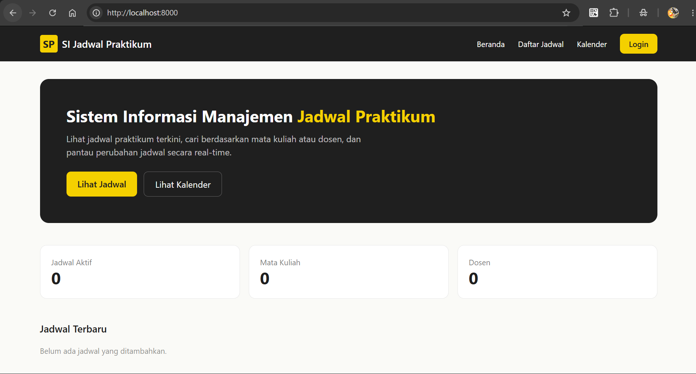
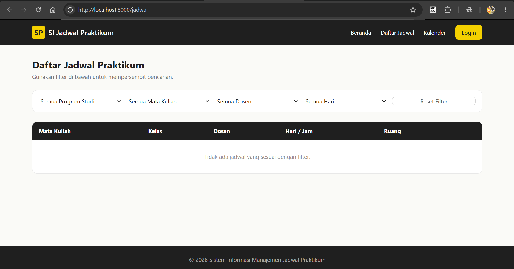
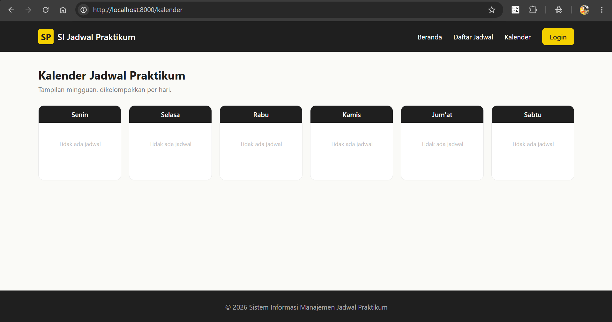
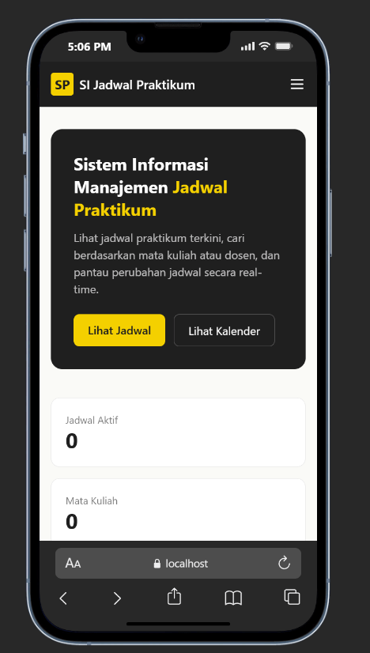

# Phase 2 — Frontend (Halaman Publik)

## Tujuan
Membangun layout dan halaman-halaman yang bisa diakses tanpa login, sebagai
bagian sistem yang paling awal bisa didemokan ke dosen pembimbing.

## File yang dibuat
| File | Fungsi |
|---|---|
| `resources/css/app.css` | Token warna tema (`--color-primary`, `--color-dark`, dst) |
| `resources/views/components/layouts/guest.blade.php` | Layout navbar publik, responsif (hamburger menu di mobile) |
| `routes/web.php` | 4 route publik: `home`, `jadwal.index`, `jadwal.detail`, `jadwal.kalender` |
| `app/Livewire/Public/Home.php` + view | Statistik ringkas + 5 jadwal terbaru |
| `app/Livewire/Public/DaftarJadwal.php` + view | Filter (Prodi/MK/Dosen/Hari) reaktif + tabel + pagination |
| `app/Livewire/Public/DetailJadwal.php` + view | Detail 1 jadwal via route-model binding |
| `app/Livewire/Public/KalenderJadwal.php` + view | Grid mingguan (6 kolom hari), tanpa dependency eksternal |

## Keputusan teknis
- **Kalender dibuat manual dengan CSS grid**, bukan pakai library seperti
  FullCalendar, supaya tidak bergantung pada CDN eksternal — lebih sederhana
  untuk kebutuhan tampilan mingguan yang statis per hari.
- **Filter pakai `wire:model.live`** (bukan `wire:model` biasa) supaya hasil
  tabel berubah langsung saat dropdown dipilih, tanpa perlu tombol submit.
- **Filter disimpan di query string** (`protected $queryString`) supaya link
  hasil filter bisa di-bookmark atau dibagikan.
- Query pakai `with([...])` (eager loading) di semua komponen untuk mencegah
  N+1 query saat me-load relasi `mataKuliah`, `dosen`, `kelas`, `ruangPraktikum`.

## Ketergantungan ke Phase 3 (Backend Core)
Kode ini butuh model & relasi berikut sudah ada:
`JadwalPraktikum::mataKuliah()`, `::dosen()`, `::kelas()`, `::ruangPraktikum()`,
`::tahunAkademik()` — semuanya `belongsTo`.

## Cara verifikasi
```bash
npm run build   # atau npm run dev saat development
php artisan serve
```
- `/` → tampil statistik & jadwal terbaru

- `/jadwal` → ubah salah satu filter, tabel harus berubah tanpa reload halaman

- `/jadwal/{id}` → detail jadwal lengkap
- `/kalender` → 6 kolom hari, masing-masing berisi jadwal aktif pada hari itu

- Resize browser ke lebar mobile → navbar berubah jadi menu hamburger

