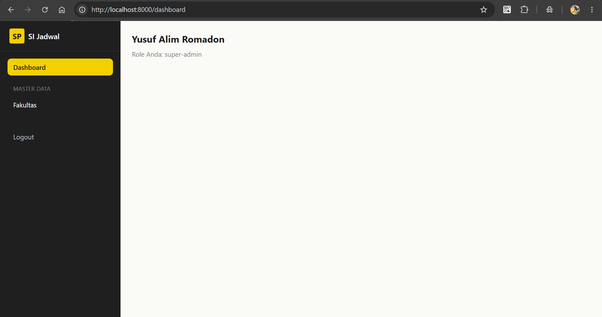
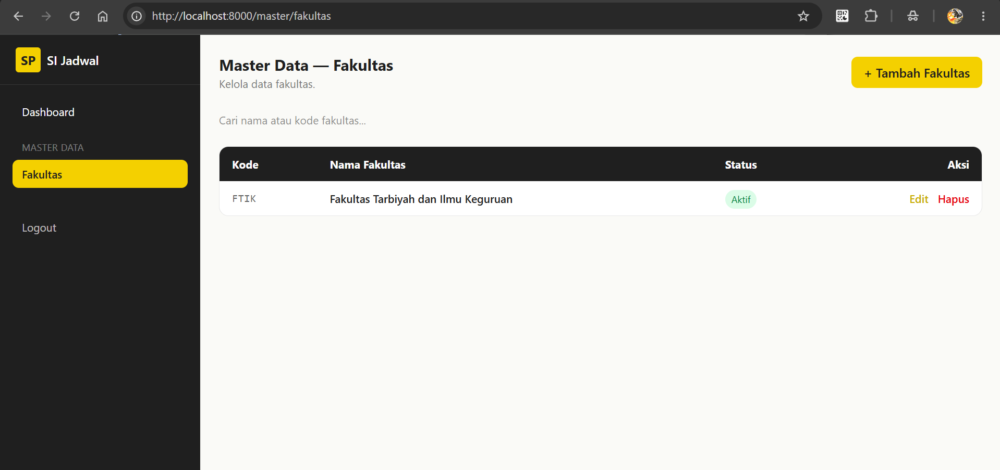
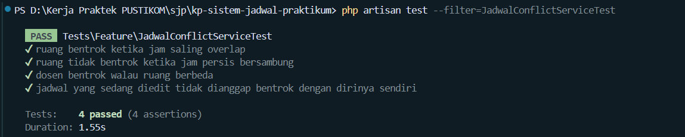

# Phase 3 (Lanjutan) — Authorization + CRUD Master Data

## Tujuan
Membatasi akses area admin berdasarkan role, dan menyediakan CRUD penuh
untuk seluruh 7 tabel master data supaya operator/admin bisa mengelola data
dasar sebelum jadwal dibuat.

## Langkah yang dilakukan
1. Daftarkan middleware alias `role`, `permission`, `role_or_permission`
   (Spatie) di `bootstrap/app.php` — Laravel 13 tidak lagi pakai
   `app/Http/Kernel.php`
2. Buat `resources/views/components/layouts/admin.blade.php` — sidebar
   dengan menu tersegmentasi per role via `@role(...)` / `@endrole`
3. Buat `resources/views/dashboard.blade.php` sebagai halaman pendaratan
   setelah login
4. Buat CRUD **Fakultas** (`FakultasIndex.php` + view) sebagai pola dasar:
   tabel + pencarian + modal create/edit + konfirmasi hapus + proteksi
   hapus data yang masih punya anak
5. Replikasi pola yang sama ke 6 master data lain: **Program Studi**,
   **Kelas**, **Mata Kuliah**, **Dosen**, **Ruang Praktikum**,
   **Tahun Akademik**
6. Tambahkan 7 route baru di `routes/web.php`, semua dibungkus
   `middleware(['auth', 'verified', 'role:super-admin|operator'])`

## File yang dibuat
```
bootstrap/app.php                                              (edit)
resources/views/components/layouts/admin.blade.php
resources/views/dashboard.blade.php
app/Livewire/Admin/MasterData/FakultasIndex.php        + view
app/Livewire/Admin/MasterData/ProgramStudiIndex.php     + view
app/Livewire/Admin/MasterData/KelasIndex.php            + view
app/Livewire/Admin/MasterData/MataKuliahIndex.php       + view
app/Livewire/Admin/MasterData/DosenIndex.php            + view
app/Livewire/Admin/MasterData/RuangPraktikumIndex.php   + view
app/Livewire/Admin/MasterData/TahunAkademikIndex.php    + view
routes/web.php                                                  (edit)
```

## Keputusan teknis
- **Satu pola CRUD dipakai untuk 7 tabel** (bukan Controller + Resource
  Route terpisah) — semua lewat Livewire full-page component dengan modal
  inline, supaya konsisten dan gampang di-maintain satu gaya.
- **Setiap `delete()` mengecek relasi anak dulu** sebelum menghapus
  (`->exists()`), lalu tampilkan pesan error yang jelas kalau data masih
  dipakai — mencegah orphan data di tabel transaksi.
- **Tahun Akademik pakai boolean `status_aktif`**, bukan enum seperti
  tabel lain, dan saat satu tahun diset aktif, tahun lain otomatis
  dinonaktifkan (`TahunAkademik::where('id','!=',...)->update(...)`) —
  memastikan hanya ada 1 tahun akademik aktif di satu waktu.
- **Sidebar dibungkus `@if (Route::has(...))`** untuk link yang belum
  tentu ada routenya (dibuat bertahap Phase 3→4), supaya halaman tidak
  crash saat route belum didaftarkan.

## Ketergantungan tambahan
Fitur proteksi hapus butuh relasi `hasMany` di beberapa model
(`Fakultas::programStudi()`, `ProgramStudi::kelas()`, `Kelas::jadwalPraktikum()`,
dst). Daftar lengkapnya ada di `RELASI_MODEL_WAJIB_ADA.md`.

## Cara verifikasi
```bash
php artisan tinker
>>> $user = App\Models\User::first();
>>> $user->assignRole('super-admin');
```

```bash
php artisan serve
```


- Login → redirect ke `/dashboard`, sidebar tampil menu Master Data lengkap
- Buka tiap `/master/*` → coba tambah, edit, cari, hapus
- Hapus Fakultas yang masih punya Program Studi → harus gagal dengan pesan
  error, bukan crash
- Logout, akses `/master/fakultas` langsung → redirect ke login
- Login dengan user tanpa role `super-admin`/`operator` → akses
  `/master/fakultas` → harus dapat 403

## Pesan commit yang disarankan
```
feat(auth+master-data): tambah role middleware dan CRUD 7 tabel master data

- Daftarkan middleware alias Spatie (role, permission) di bootstrap/app.php
- Tambah layout admin dengan sidebar per role
- CRUD Fakultas, Program Studi, Kelas, Mata Kuliah, Dosen,
  Ruang Praktikum, Tahun Akademik (Livewire + modal, dengan
  proteksi hapus data yang masih punya relasi anak)
- Tambah 7 route terproteksi role:super-admin|operator
```

## Melakukan Test 
1. ruang bentrok ketika jam saling overlap
2. ruang tidak bentrok ketika jam persis bersambung
3. dosen bentrok walau ruang berbeda
4. jadwal yang sedang diedit tidak dianggap bentrok dengan dirinya sendiri

php artisan test --filter=JadwalConflictServiceTest
