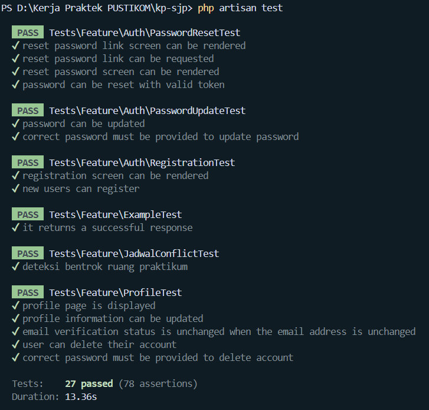

# Dokumentasi Perkembangan Proyek: Phase 3 (Backend Core & Business Logic)

Dokumentasi ini merangkum tahapan implementasi core backend untuk **Sistem Informasi Manajemen Jadwal Praktikum (SJP)** UIN Siber Syekh Nurjati Cirebon (UINSSC). Fokus pada fase ini adalah pembangunan fondasi database (migration), pemetaan relasi Eloquent, seeding data master, hingga implementasi layanan validasi bentrok jadwal (*conflict checking service*).

---

## 1. Daftar Tabel & Struktur Migrasi Database

Seluruh tabel dirancang terstruktur sesuai PRD final (tanpa ada data master yang di-*hardcode* di *source code*).

### A. Tabel Master Tanpa Foreign Key
* **`fakultas`**: Menyimpan data fakultas induk.
* **`dosen`**: Menyimpan data identitas dosen pengampu.
* **`ruang_praktikum`**: Menyimpan data fisik/virtual ruangan (default status TBD jika data belum lengkap).
* **`tahun_akademik`**: Menyimpan rentang tahun akademik dan status aktif.

### B. Tabel Master Berjenjang (Dengan Foreign Key)
* **`program_studi`**: Berelasi `belongsTo` ke `fakultas`.
* **`kelas`**: Berelasi ke `program_studi`. Menyimpan informasi kelompok kelas (contoh: 7A, 5B) terpisah dari semester.
* **`mata_kuliah`**: Berelasi ke `program_studi`. Menyimpan atribut **SKS** dan **Semester** langsung di tingkat mata kuliah (sesuai Keputusan Section 8 PRD).

### C. Tabel Transaksional Utama & Pengajuan
* **`jadwal_praktikum`**: Tabel inti yang menghubungkan 5 kunci master (`mata_kuliah_id`, `kelas_id`, `dosen_id`, `ruang_praktikum_id`, `tahun_akademik_id`) ditambah atribut hari, jam mulai, jam selesai, dan status.
* **`pengajuan_perubahan`**: Menyimpan riwayat usulan perubahan jadwal oleh dosen dengan status (*Menunggu*, *Disetujui*, *Ditolak*) beserta catatan penolakannya.

---

## 2. Pemetaan Model & Relasi Eloquent

Seluruh model telah dikonfigurasi dengan relasi *One-to-Many* dan *Belongs-To* secara tepat:

* **`Fakultas`** $\rightarrow$ `hasMany(ProgramStudi::class)`
* **`ProgramStudi`** $\rightarrow$ `belongsTo(Fakultas::class)`, serta `hasMany(Kelas::class)` & `hasMany(MataKuliah::class)`
* **`Kelas` / `MataKuliah`** $\rightarrow$ `belongsTo(ProgramStudi::class)`
* **`JadwalPraktikum`** $\rightarrow$ `belongsTo` ke kelima entitas master secara utuh.

---

## 3. Seeding Data Master & Role Permission

Sistem menggunakan **Spatie Laravel Permission** untuk manajemen kontrol akses berbasis peran (*Role-Based Access Control*):
1. **`RolePermissionSeeder`**: Mendefinisikan role `super-admin`, `operator`, dan `dosen` beserta hak akses (*permissions*) spesifik.
2. **`MasterDataSeeder`**: Mengisi data awal dummy untuk fakultas, program studi, mata kuliah, kelas, dosen, dan tahun akademik aktif agar aplikasi dapat langsung dieksplorasi.

Perintah reset dan sinkronisasi database:
```bash
php artisan migrate:fresh --seed
```

---

## 4. Implementasi `JadwalConflictService`

Untuk mencegah konflik penggunaan ruangan maupun jadwal mengajar dosen yang bertabrakan, logika validasi dipisahkan ke dalam service layer terpisah (`app/Services/JadwalConflictService.php`).

Formula irisan waktu (*time overlap interception*) yang digunakan:
$$\text{jam\_mulai} < \text{jam\_selesai\_baru} \quad \text{AND} \quad \text{jam\_selesai} > \text{jam\_mulai\_baru}$$

Method utama dalam service:
* `cekBentrokRuang(...)`: Memvalidasi ketersediaan ruang pada hari dan tahun akademik yang sama.
* `cekBentrokDosen(...)`: Memvalidasi ketersediaan jadwal mengajar dosen agar tidak ada jam mengajar ganda di waktu yang bersamaan.

---

## 5. Pengujian Otomatis (Feature/Unit Test)

Sebagai bukti validasi core system untuk laporan Kerja Praktik (KP), telah disiapkan pengujian otomatis menggunakan Pest/PHPUnit (`tests/Feature/JadwalConflictTest.php`) yang mereplikasi skenario persis pada **PRD Section 21**:
* **Skenario Bentrok**: Ruang A terisi pukul `08:00 - 10:00`, diuji dengan jadwal baru pukul `09:00 - 11:00` $\rightarrow$ Sistem mengembalikan nilai `true` (Terdeteksi Bentrok).
* **Skenario Aman**: Ruang A terisi pukul `08:00 - 10:00`, diuji dengan jadwal baru pukul `10:00 - 12:00` $\rightarrow$ Sistem mengembalikan nilai `false` (Tidak Bentrok / Valid).

Jalankan pengujian via terminal:
```bash
php artisan test
```

